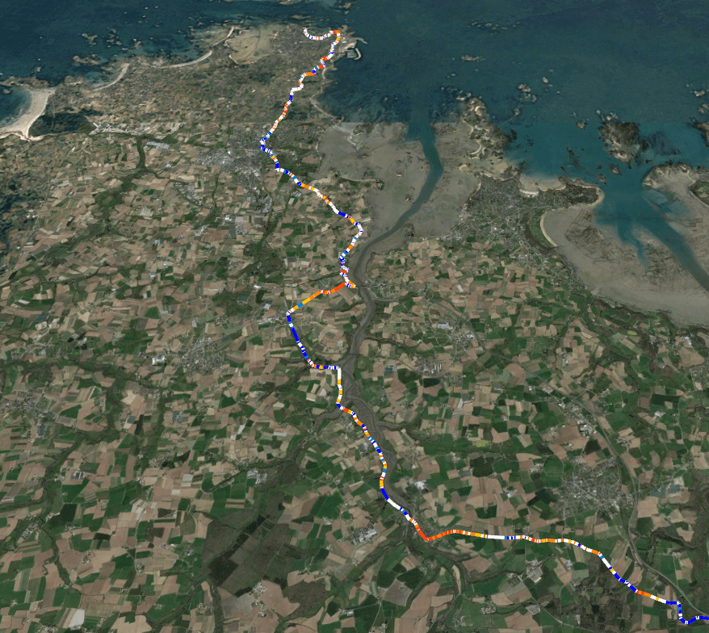

# GPX Elevation Visualizer



This tool allows you to visualize elevation data from GPX or KML files using color gradients reflecting the slope of the track.

## Features:
- Support for GPX and KML files.
- Color scale from -30 to +30 degrees.
- Drag & Drop interface for easy use.
- Automatic elevation data download from the OpenTopoData API.

## Installation

1. Install dependencies:
```bash
pip install -r requirements.txt
```

### Via the command line:
```bash
python gpx_elevation_visualizer.py input_file.gpx
```

### Via the GUI (Drag & Drop):
Run the `gpx_visualizer_ui.py` script and drag the file onto the application window.

There are also convenient .sh and .bat files for launching the UI :)

For Linux and MacOS, you need to grant launch permissions the first time.
Linux/MacOS:
```bash
chmod +x run_linux_or_mac.sh
```

Windows
```bash
run_windows.bat
```
Linux/MacOS
```bash
run_linux_or_mac.sh
```
